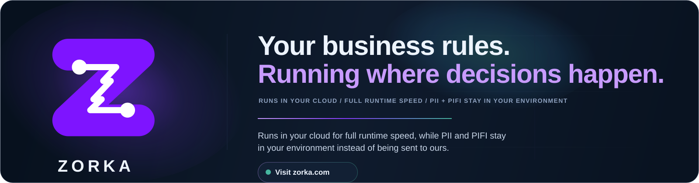
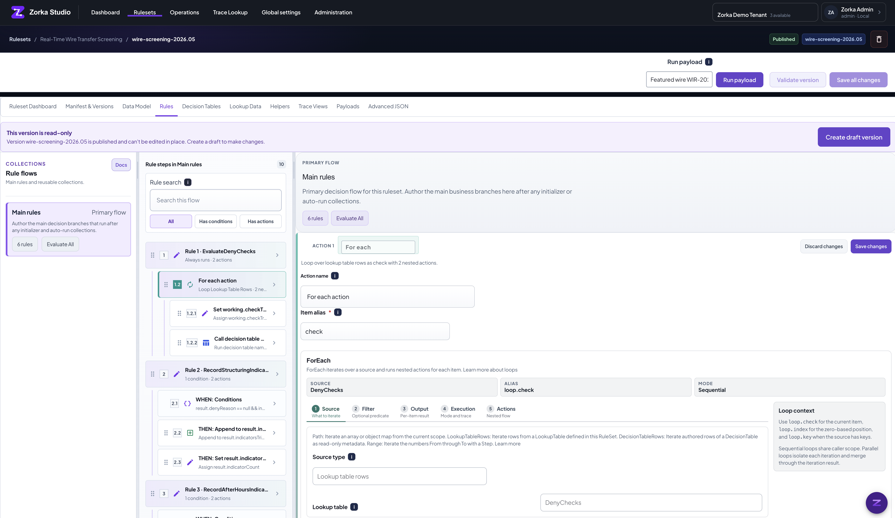

  

  <strong>Private-runtime decision platform for business-owned rules.</strong>

  Zorka helps teams author, test, compose, explain, and run business decisions without moving sensitive workflow data into a shared rules SaaS.

  Policy owners get Studio. Engineers get versioned contracts, runtime control, and embeddable execution. Operators get traces they can actually read.

  <a href="https://zorka.com">Visit zorka.com</a>
  ·
  <a href="https://zorka.com/docs">Read docs</a>

  

---

## What Zorka Is

Zorka is a rules authoring and execution platform for teams whose decisions are too important to hide in application code, spreadsheets, or a black-box model prompt.

The core idea is simple: business teams should be able to own the policy, engineering teams should be able to trust the runtime contract, and sensitive payloads should stay in the customer's environment.

| Layer | What Zorka gives you |
| --- | --- |
| Authoring | Zorka Studio for rules, decision tables, lookup data, schemas, payloads, trace views, and AI-assisted change proposals |
| Runtime | A fast private runtime host that executes rules close to your application and data |
| Composition | Reusable RuleSets, rule collections, loops, child calls, pinned references, and shared or global building blocks |
| Explainability | Versioned Trace Views and execution-flow traces for the exact rule version, payload, runtime options, and dependencies that ran |
| Governance | Account, organization, and tenant boundaries; visibility controls; schema drift checks; publish-time validation; runtime version routing |
| Integration | API and client helpers, batch execution, embedded consumers, self-contained local evaluation, and hosted deployment paths |

---

## What Teams Can Build With It

Zorka combines the pieces teams usually have to stitch together themselves:

- **Studio authoring for real rules.** Authors can build rules, reusable rule flows, decision tables, lookup data, input and result schemas, payload libraries, and Trace Views without dropping into raw JSON for everyday work.
- **AI-assisted change proposals.** Ziggy reads the open ruleset context, drafts reviewable changes, and lets authors approve, reject, or refine the proposal inside the workbench.
- **Composable RuleSets.** `ExecuteRuleSet` lets one RuleSet call another through a named alias. The callee runs in a sealed scope, the caller reads only the published result surface, and pinned/latest/self reference modes make reuse explicit.
- **First-class loops and batch execution.** `ForEach`, `While`, `DoWhile`, and `LoopControl` handle iteration inside one decision. Runtime-host batch execution handles many independent inputs with ordered row artifacts and bounded concurrency.
- **Decision tables with guardrails.** Hit policies such as Unique, Any, First, Rule order, and Collect make row behavior explicit, while analysis catches overlap, conflicts, unreachable rows, and gaps before rules meet traffic.
- **Typed expressions.** Collection, predicate, date, numeric, null-safe, list, and object helpers are available through a capability-driven expression catalog, with static checks against the ruleset schemas.
- **Trace Views and execution flow.** Runs can be explained through business-readable views while still preserving the runtime truth: matched rules, nested RuleSet calls, loop iterations, dependency versions, runtime options, and result snapshots.
- **Private runtime execution.** Rules run close to the customer's application and data, with runtime version routing, versioned bundle and trace envelopes, schema drift protection, and a self-contained local package for real-stack evaluation.

The result is a platform where a rule can be drafted by AI, reviewed by a policy owner, validated against typed schemas, load-tested, called by another RuleSet, traced through nested execution, and run in the customer's environment.

---

## Built For Decisions That Need Evidence

- Insurance eligibility, census rating, claim adjudication, and carrier-wide batch processing
- Wire screening, compliance holds, risk bands, and regulated approval flows
- Marginal tax, payroll, withholding, pricing, and jurisdiction-specific calculations
- Shopping cart promotions, loan qualification, pricing bands, and review flags
- Multi-tenant products that need shared business logic without shared customer data
- Teams that need business-owned rules without low-code ambiguity or runtime mystery

Zorka's seeded examples are not toy demos. They exercise the same runtime features the platform exposes: `ExecuteRuleSet`, child RuleSets, sequential and parallel `ForEach`, `LoopControl`, `Collect` hit policies, typed expressions, schema validation, and trace execution flow.

---

## What You Will Find Here

This GitHub organization is where Zorka's public engineering surface will grow: examples, integrations, starter assets, SDK/package work, deployment helpers, and supporting repositories around the product.

If you are evaluating whether Zorka fits your stack, start with the product story at [zorka.com](https://zorka.com) or the docs at [zorka.com/docs](https://zorka.com/docs).
